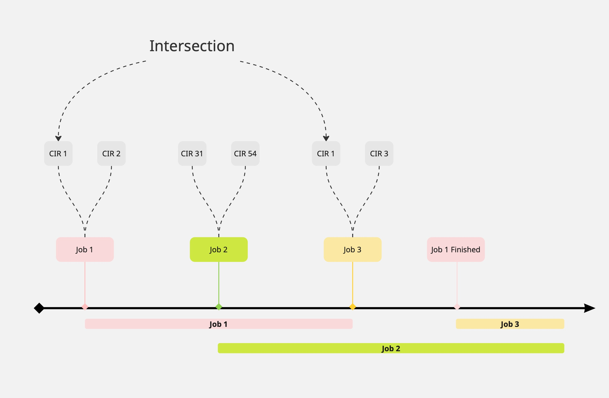
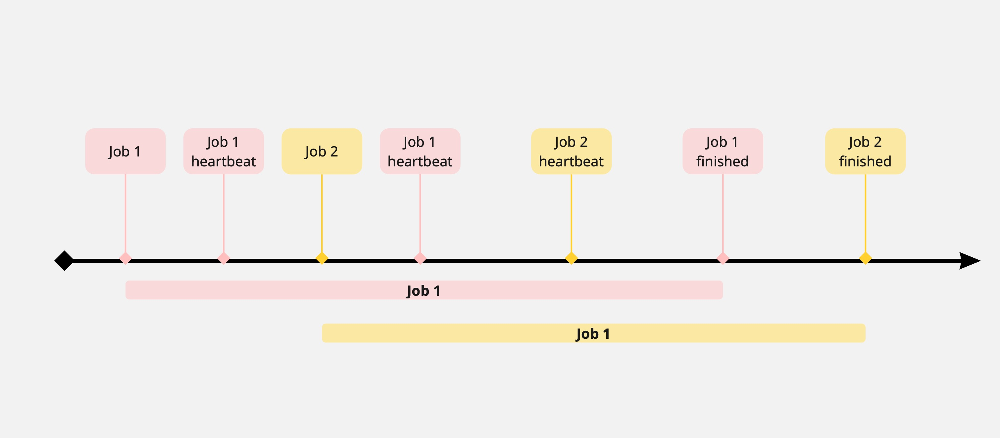
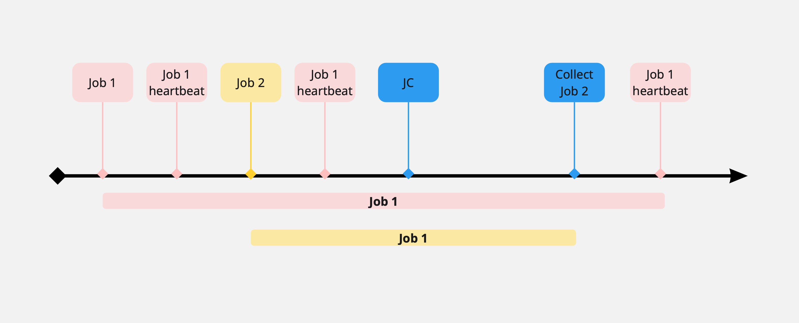

**Author:** Anatoly Nikiforov, 2023  
**Status:** ✅ Production  
**Period:** 2023-2025  
**Company:** MIND Software

---

The basic unit of concurrency around the Universe is known as **Job**. The Job — is an MQ message containing Job's GUID, the Unified Models of CIRs it meant to work on, logs and so on. Jobs are executed concurrently. To handle Jobs and track down their state, the **Job Pool** introduced.

---

## The Job Pool

The Job Pool is a structure that collects all the jobs in two different states. There are **running** and **waiting** jobs in the Job Pool.

The main responsibility of Job Pool is to decide whether to instantly execute a particular job coming from MQ or enqueue it keeping it in the local memory (another option is to send it back to MQ, but this requires additional MQ calls over time). An enqueued job then waits for its execution in the Job Pool.

---

## Job Execution Criteria (JEC)

Every time a new job arrives from an MQ into the main process, it being handled two different ways, depending on some conditions known as **job execution criteria (JEC)**. The result of handling a job is either executing it immediately or delaying it by putting into the pool as a job, waiting for conditions are met for execution.

---

## The Intersection Criterion

One of the first criteria implemented in Universe is an **intersection criterion**. It is implemented to solve a problem of simultaneous updates of the same CIRs when it's hard to reason about the behaviour of an end-cloud infrastructure. In such cases, Universe does not rely on end-cloud infrastructure, instead it uses a job pooling mechanism to resolve it locally. The condition of solving it this: if there is a job already updating some CIR and there is another incoming job from MQ containing the same CIR, then an incoming one is blocked. The blocking of job means that there is an intersection criterion occurred between these jobs, and an incoming one should be placed in the pool, instead of executing it. The blocked jobs are then waiting their execution in the pool until the running jobs matched their intersection criterion are executed.

### Figure 1: Intersection Criterion Demonstration

*The figure 1 below demonstrates an intersection criterion.*

The JEC itself is a boolean function, so it's easy to extend that logic with additional criteria.

---

## The Job Event Messaging Protocol

Along with JEC, **Job Event Messaging Protocol** is a part of the job pooling mechanism. JEMP allows the pool to track the state of jobs it runs concurrently. The main communication channel for JEMP is knows as **Event Bus**. The communication over Event Bus occurs between the pool and the job executed. The main reason for JEMP is to provide the pool with a knowledge of job execution results.

### Event-Driven

JEMP currently implements three type of messages known as **Events**:

| Event Type | Description |
|------------|-------------|
| **Heartbeat Event** | Reported by the running job, indicating the correct behaviour |
| **Finished Event** | The last event reported from the running job, indicating the successful execution |
| **Internal Event** | A reserved event type reported by JC and other system services |

Events are reported from the jobs back to the pool through the event bus. If there is no any event reported by some running job for a long time, then such job considered **lost**.

### Figure 2: Heartbeat Events During Job Execution

*The figure 2 below shows how the heartbeat events occurred during the job execution.*

---

## The Job Collector (JC)

Lost jobs are collected by the **Job Collector (JC)** mechanism. JC is a background service that runs over jobs being executed and decides whether to delete (unregister) them from the pool. The algorithm of JC is a straightforward one: it looks at the time the last heartbeat of a job reported. If this time is later than a configurable timeout, then the job considered lost and being unregistered from the pool as none of the interest.

### Figure 3: Resolving Lost Jobs by JC

*The figure 3 below shows resolving a lost job by JC while the other job is continuing to run, reporting its heartbeats.*

---

## The Checkpointer

Another mechanism of the Job Pool is a **Checkpointer**. It is responsible for creating checkpoints for configurable amount of time (checkpoint intervals). Checkpoints are persisted snapshots of the Job Pool "actual" state with running and queued jobs. Creating checkpoints with a periodic amount of time is required by the Job Pool to remember the last state of the queued Jobs after an "accident". Before starting to accept new messages from the MQ, the Job Pool is looking for the last checkpoint to start working on the previous queued jobs, if any available. This helps not to lose the Jobs the user attempted to run previously.

---

## Conclusion

The Job Pool is an event-driven system to control an execution flow of jobs running concurrently. At the core of its mechanism, there is an Event Messaging Protocol, allowing the Job Pool to communicate and reason about the jobs it executes. There are system events reserved for the internal services, such as the Job Collector. The main reason behind the Job Pool is to be able to track down an execution flow of jobs, collect the statistics, resolve the potential conflicts between the jobs and allow the flexible workload.

---

## Related Specifications

- [MHA](mha.md)
- [SSA](ssa.md)
- [Validation Stack](validation-stack.md)
- [Transactional Models](transactional-models.md)

---

## Source

**Experience:** [MIND Software](../experience/mind-software/) | **Period:** Февраль 2023 — Февраль 2025
