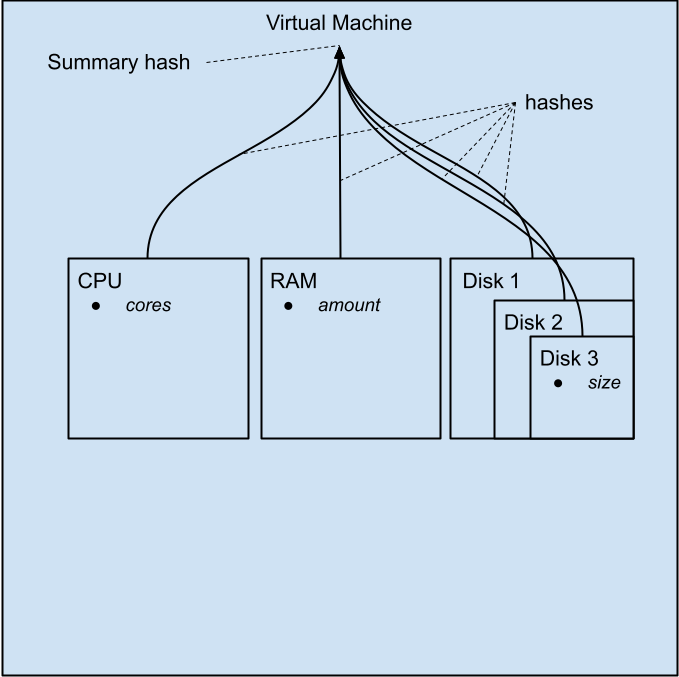
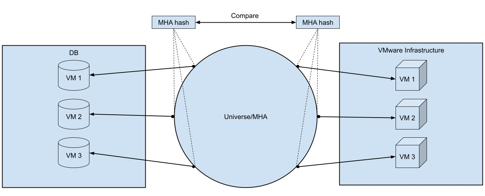

**Author:** Anatoly Nikiforov, 2023  
**Status:** ✅ Production  
**Period:** 2023-2025  
**Company:** MIND Software

---

The core concept of MIND Universe that allows it to work effectively is known as **Unified Models**. Those are considered a unified representation of a cloud infrastructure resource (CIR) containing an information that is common across different cloud computing services.

The **Model Hashing Algorithm** is applied during **Refresh and Update** actions of Universe's DRUID action stack. It serves for detecting changes between the latest database record of a CIR that Universe stores and the information about this CIR on the site of specific cloud infrastructure.

The MHA compares those facts with a database record and decides about changes of a particular CIR. It is a **nested hashing algorithm** designed to follow a particular CIR structure. Meanwhile, MHA is **bidirectional**, meaning that it allows comparing CIR records and related facts the same way.

---

## Nested Hashing

### Figure 1: Universe Hashing Model for a Virtual Machine

*Figure 1: Universe hashing model for a virtual machine*

The figure 1 shows a nested hashing model that Universe uses to build a hash of such CIR as a virtual machine or virtual server. The structure of a virtual machine may consist of components like CPU, RAM, Operating system, ID, etc. Some components are common across different cloud computing services, while others are vendor-specific. For example, some service reports and ID of a virtual machine in format of GUID while another one uses a natural numbers sequence for that.

In the same time, the structure of CIR itself differs across cloud computing services. For example, the virtual machine representation of some service could imply a vendor-specific information like the virtual machine's floppy drives or serial ports while some other service does not support these devices. The approach of MHA, again, is to build a hash of the CIR components present everywhere: CPU, RAM, Disks, etc. The variable values of those components act as source of true for calculating a hash of the entire virtual machine. This approach makes it possible to build and compare hashes for both the unified CIR model and the facts of the concrete CIR present in the target infrastructure. The whole information for building a hash is the same on the both sides.

---

## Bidirectional

The first direction of MHA is known as **Unified Models**. They are stored by the Universe as a database records of related CIR. The purpose of MHA is to calculate a hash of these records to compare with a relevant state of related CIRs known as **facts**.

The second direction of MHA is **facts** about specific CIR coming on request of Universe to some cloud computing service. The facts are meant to be a source from which the unified model is built. Thus, facts contain all the information the unified model does, making it possible to apply MHA to the CIR in its relevant state almost the same way as for the unified model itself. As a result, the Universe compares the hashes of both directions to find CIR changes during **Refresh and Update** actions.

### Figure 2: Universe Applies MHA to Both CIR and DB Record

*Figure 2. Universe applies MHA to both CIR and DB record.*

---

## Related Specifications

- [JEMP](jemp.md)
- [SSA](ssa.md)
- [Validation Stack](validation-stack.md)
- [Transactional Models](transactional-models.md)

---

## Source

**Experience:** [MIND Software](../experience/mind-software/) | **Period:** Февраль 2023 — Февраль 2025
