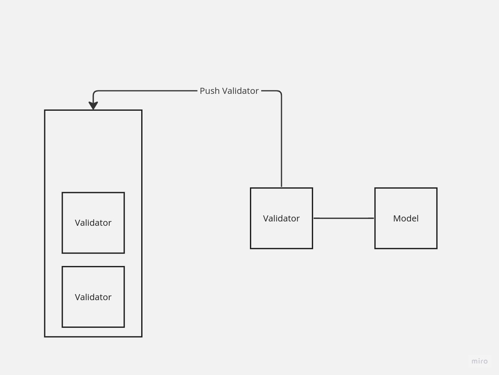
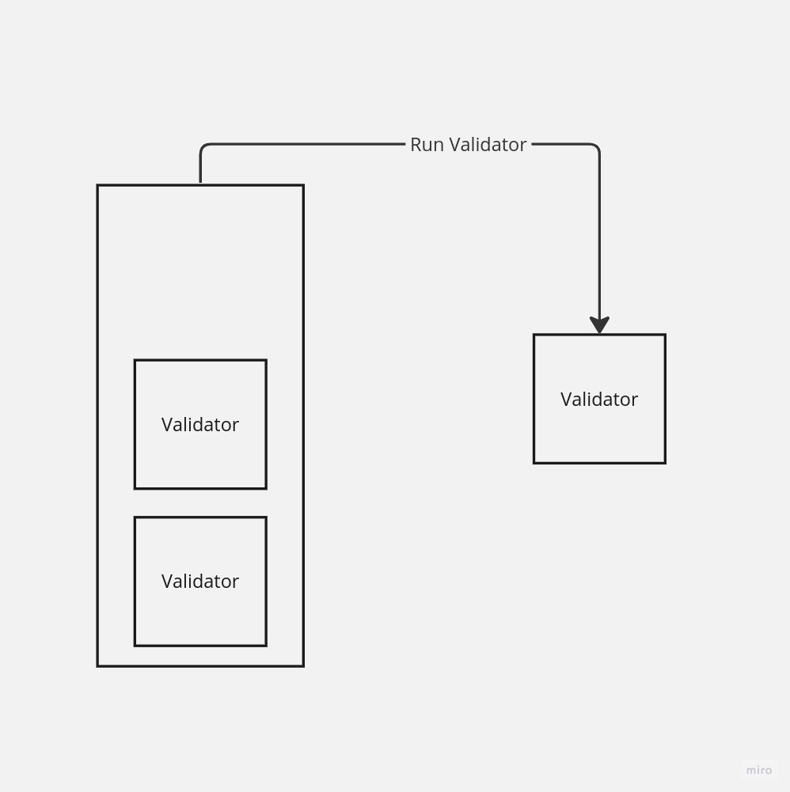
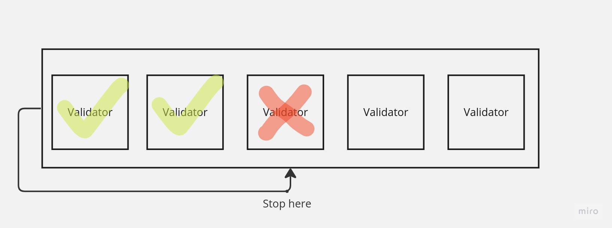
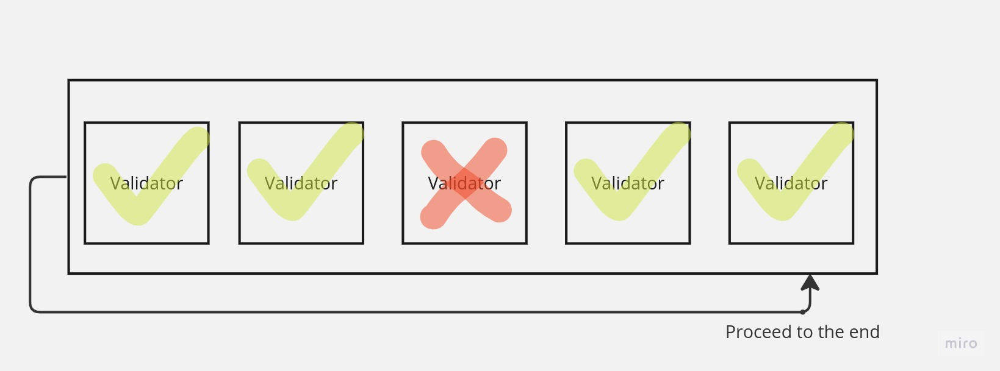

# Universe Validation Stack

**Author:** Anatoly Nikiforov, 2023  
**Status:** ✅ Production  
**Period:** 2023-2025  
**Company:** MIND Software

---

The main objects of validation are so-called **Unified Models**. They are usually located in the Job as a part of execution scenario. In Universe, we try to validate those models because their data is used to interact with target infrastructures. The validation itself is not a necessary, as we may always rely on the target site infrastructures. Anyway, we prefer to have an **additional validation layer** to handle possible user input errors in Universe before they go to the actual infrastructure. This is possible because Universe has knowledge of legit requests it sends to the sites it supports.

Thus, we try to use a **single place for all the validations** that may occur during the job execution. This place is known as the **Validation Stack**.

---

## The Validation Stack

### Figure 1: Pushing the New Validator

*Figure 1. Pushing the new Validator to the Validation Stack.*

The Validation Stack, as the name suggests, is a **classic stack data structure**. It is used to store Validators in a classic stack manner. A validator is a programmer-defined, pluggable entity, that validates a single Unified Model and reports the result. Each validator could validate a single field of a Unified Model, or implement more complex validation logic.

After pushing some amount of Validators into the Validation Stack, we can run this **Validation Chain as FILO**. The Validation Stack then will run the Validators and collect the validation results for further analysis. At the end of execution, the Validation Stack is empty.

### Figure 2: Running the Validation Stack

*Figure 2. Running the Validation Stack.*

---

## Reusable Validators

Validators might be **reusable** if we want to run the same validations multiple times. In that case, Validation Stack will keep them even after running the Validation Chain.

Moreover, it will keep only those Validators from the Validation Chain, that were marked to be **reusable**. That means, we could have a sequence of reusable and non-reusable Validators in the Validation Stack. After running this type of Validation Chain, the Validation Stack will keep **N-N(reus.)** amount of Validators to be run again. In other words, the Validation Chain becomes shorter on the amount of non-reusable chain links.

---

## The Scopes of Usage

There are two known scopes of applying the Validation Stack:

| Scope | Name | Purpose |
|-------|------|---------|
| **Global** | Site Worker | Validate across the Job (e.g., look for duplicates) |
| **Models** | Site Driver | Check specific fields of Unified Models |

The behaviour of the Validation Stack is a scope-dependent. For example, in the "global" scope, we want to use a Validator that looks for duplicates of Unified Models across the Job. At the same time, in the models scope, we are interested in checking some specific fields of Unified Models. This two-layered architecture sets the relevant modes of the Validation Stack.

---

## The Strict Mode

Remember, each Validator reports a **positive or negative result**. The strict mode of the Validation Stack stands for whether to proceed running Validators after the negative result occurred, or to stop there.

### Figure 3: Strict Mode Workflow

*Figure 3. The Strict mode workflow.*

---

## The Fault-Tolerant Mode

In the tolerant mode, the Validation Stack will run the Validators until the last one ignoring the negative results, but keeping them along with positive ones for further analysis.

### Figure 4: Fault-Tolerant Mode Workflow

*Figure 4. The tolerant mode workflow.*

---

## Related Specifications

- [MHA](mha.md)
- [JEMP](jemp.md)
- [SSA](ssa.md)
- [Transactional Models](transactional-models.md)

---

## Source

**Experience:** [MIND Software](../experience/mind-software/) | **Period:** Февраль 2023 — Февраль 2025
